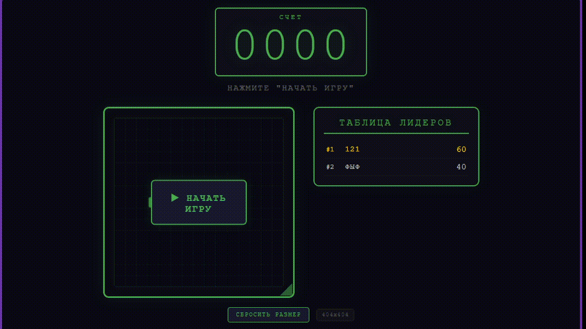

# 🐍 Snakee - Ретро-змейка      

---

## Описание
Игра "Змейка", выполненная в духе старых игровых автоматов. Игрок управляет змейкой, собирает еду и зарабатывает очки. В игре реализована система сохранения рекордов с таблицей лидеров.
### Особенности:
- Система рекордов с сохранением в браузере
- Таблица лидеров (топ-10)
- Адаптивное игровое поле с возможностью изменения размера
## Технологический стек

- **Frontend**: HTML5, CSS3, Vanilla JavaScript (ES6)
- **Хранение данных**: localStorage (браузерное хранилище)
- **Графика**: Canvas API
- **Деплой**: Vercel

## Запуск проекта локально
- Клонируйте репозиторий
git clone https://github.com/Sarsela/Snakee.git
- Перейдите в папку проекта
cd snake-game
- Откройте index.html в браузере
- Или используйте Live Server в VS Code

## Деплой
**Ссылка на рабочий сайт**:  https://snakee-delta.vercel.app
https://snakee-delta.vercel.app/
## Демонстрация

